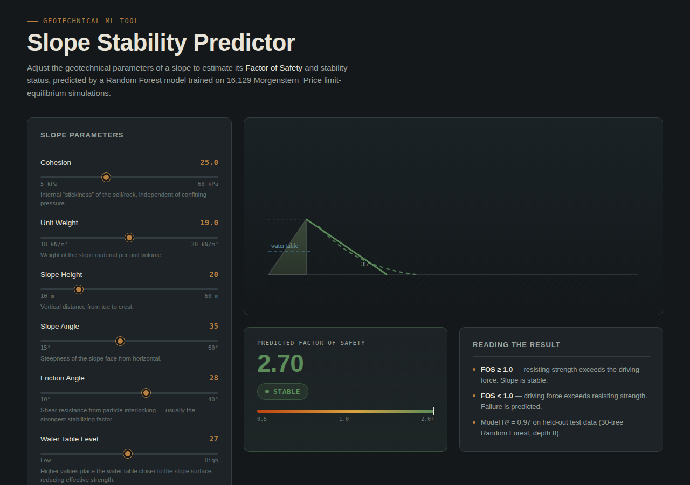
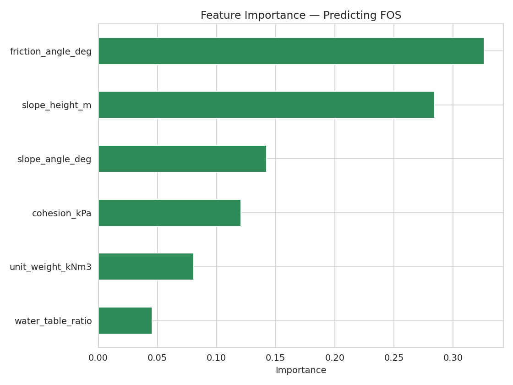

# Slope Stability Prediction using Machine Learning

An AI-based tool that predicts the **Factor of Safety (FOS)** of a slope and classifies it as **Stable / Unstable**, built for open-pit mine and geotechnical slope risk assessment. Includes a full analysis notebook and a standalone, no-install web tool for real-time predictions.

**[Live Demo](#)** — replace with your GitHub Pages link once hosted (see [Hosting the Web Tool](#hosting-the-web-tool) below)



---

## Why This Matters

Slope failures in open-pit mines and civil excavations are a major safety and cost risk. Traditional stability analysis (limit equilibrium methods like Morgenstern-Price) is accurate but computationally slow — it requires slicing the slope into segments and iteratively solving for the critical failure surface. This project trains a machine learning model on thousands of pre-solved simulations, allowing near-instant FOS estimation from basic geotechnical parameters — useful for rapid screening before running a full formal analysis.

---

## Dataset

- **16,129 datapoints**, generated using the **Morgenstern-Price limit equilibrium method** for unsaturated slopes
- Source: Kenue Abdul Waris & Mohammed Asif ur Rahaman, IIT Hyderabad — *"Detection and prediction of slope stability in unsaturated finite slopes using interpretable machine learning"*
- Original data: [github.com/abdwaris/unsaturated_slope](https://github.com/abdwaris/unsaturated_slope)

**Parameters used:**

| Parameter | Description |
|---|---|
| Cohesion (kPa) | Internal "stickiness" of the soil/rock |
| Unit Weight (kN/m³) | Weight of material per unit volume |
| Slope Height (m) | Vertical height, toe to crest |
| Slope Angle (°) | Steepness of the slope face |
| Friction Angle (°) | Shear resistance from particle interlocking |
| Water Table Level | Position of the water table relative to the slope |

*(The dataset also includes Fredlund-Xing soil-water characteristic curve fitting parameters, used in the full regression model but excluded from the deployed web tool since they aren't practically known values for a general user.)*

**Target:** Factor of Safety (FOS) → derived label: **Stable** (FOS ≥ 1.0) or **Unstable** (FOS < 1.0)

---

## Methodology

1. **Exploratory Data Analysis** — distributions, correlation heatmap, parameter-vs-FOS relationships
2. **Regression** — Random Forest Regressor predicting FOS (R² = 0.996, MAE = 0.022)
3. **Classification with class imbalance handling** — the dataset is imbalanced (91% Stable / 9% Unstable). Compared:
   - Logistic Regression (baseline)
   - Random Forest (no class weighting)
   - Random Forest with `class_weight='balanced'`

   Evaluated using precision/recall/F1 **on the Unstable class specifically**, since overall accuracy is misleading under imbalance and the Unstable case is the safety-critical outcome.
4. **Broader model comparison** — extended the comparison to five classifier types (Logistic Regression, Random Forest, Gradient Boosting, SVM, K-Nearest Neighbors) on the same train/test split, again scored on Unstable-class precision/recall/F1/ROC-AUC.
5. **Cross-validation & hyperparameter tuning** — 5-fold stratified cross-validation quantifies each model's variance (mean ± std Unstable-F1 across folds) instead of relying on a single train/test split, and `RandomizedSearchCV` tunes each model's key hyperparameters (e.g. Random Forest's `max_depth`/`min_samples_leaf`, SVM's `C`/`gamma`) rather than using defaults or hand-picked values.
6. **Feature Importance** — identifies which parameters drive stability predictions
7. **Deployment** — exported a lightweight 30-tree Random Forest directly into JavaScript, embedded in a single self-contained HTML file (no server, no dependencies)

---

## Results

| Metric | Value |
|---|---|
| Regression R² (FOS) | 0.996 |
| Regression MAE | 0.022 |
| Classification Accuracy | 99.6% |
| Unstable-class Recall (balanced RF) | 0.99 |
| Unstable-class Precision (balanced RF) | 0.99 |

**Key finding:** Friction angle and slope geometry (height, angle) are the strongest predictors of stability — consistent with established geotechnical theory (Mohr-Coulomb failure criterion).

### Model Comparison (5-fold cross-validated, Unstable-class F1)

| Model | Baseline CV F1 (mean ± std) | Tuned CV F1 |
|---|---|---|
| K-Nearest Neighbors | 0.984 ± 0.003 | 0.981 |
| Random Forest (balanced) | 0.980 ± 0.004 | 0.981 |
| Gradient Boosting | 0.974 ± 0.003 | 0.973 |
| SVM (RBF, balanced) | 0.932 ± 0.014 | 0.965 |
| Logistic Regression | 0.838 ± 0.024 | 0.838 |

Cross-validation shows Random Forest, Gradient Boosting, and KNN are closely matched and consistently strong across folds, while Logistic Regression's higher variance and lower ceiling reflect its inability to model the non-linear boundary between Stable and Unstable slopes. Hyperparameter tuning (`RandomizedSearchCV`, scored on Unstable-class F1) gave the largest improvement to SVM after tuning `C` and `gamma`. **Random Forest (balanced)** remains the model exported to the web tool, since it combines top-tier, low-variance performance with the interpretable feature-importance view above.



---

## Web Tool

A single-file, dependency-free HTML/CSS/JavaScript application:
- 6 interactive sliders for slope parameters
- Live SVG cross-section diagram (slope geometry, water table, critical slip surface) that updates in real time
- Instant FOS prediction and Stable/Unstable verdict, computed entirely client-side (no backend, no API calls)

### Hosting the Web Tool

To host it live via GitHub Pages:
1. Push this repo to GitHub
2. Go to **Settings → Pages**
3. Set source to your main branch, folder `/webapp`
4. Your live tool will be available at `https://<your-username>.github.io/<repo-name>/webapp/slope_stability_website.html`

---

## Tech Stack

- **Python** — pandas, NumPy, scikit-learn, matplotlib, seaborn
- **Jupyter Notebook** — analysis and model development
- **HTML / CSS / JavaScript** — client-side deployment (trained model exported to JSON and evaluated in-browser)

---

## Repository Structure

```
slope-stability-prediction/
├── README.md
├── requirements.txt
├── data/
│   └── slope_stability_dataset.csv
├── notebook/
│   └── slope_stability_prediction.ipynb
├── webapp/
│   └── slope_stability_website.html
└── images/
    ├── website_screenshot.png
    ├── correlation_heatmap.png
    └── feature_importance.png
```

---

## How to Run

**Notebook:**
```bash
git clone https://github.com/<your-username>/slope-stability-prediction.git
cd slope-stability-prediction
pip install -r requirements.txt
jupyter notebook notebook/slope_stability_prediction.ipynb
```

**Web Tool:**
Simply open `webapp/slope_stability_website.html` in any browser — no installation required.

---

## Limitations

- Data is generated via physics-based simulation (Morgenstern-Price method), not measured from live field sensors or real slope monitoring instruments
- The dataset is imbalanced (91% Stable / 9% Unstable); this was explicitly investigated and addressed via class weighting rather than ignored
- This tool provides an ML-based estimate for educational and screening purposes only, and does not replace certified geotechnical analysis

---

## Acknowledgments

Dataset created by Kenue Abdul Waris and Mohammed Asif ur Rahaman (IIT Hyderabad). This project builds an independent ML pipeline and deployment layer on top of their published simulation data.

## License

This project is licensed under the MIT License — see [LICENSE](LICENSE) for details.
